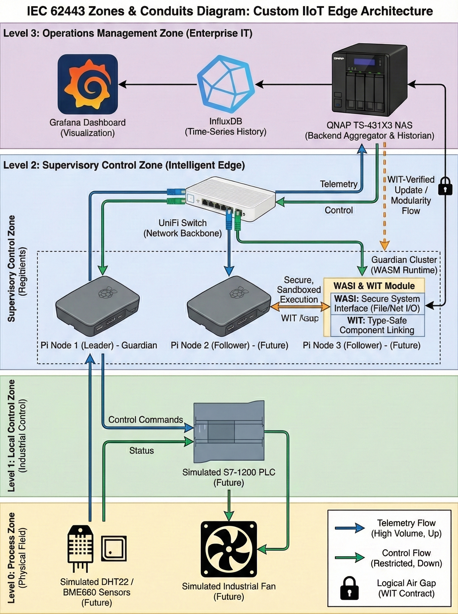
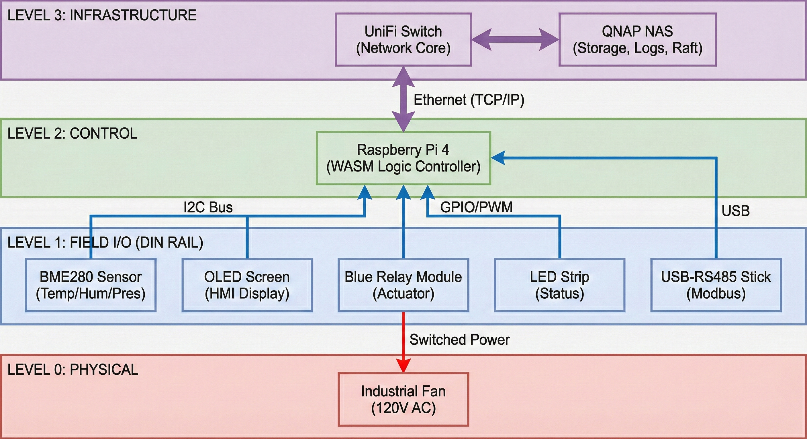
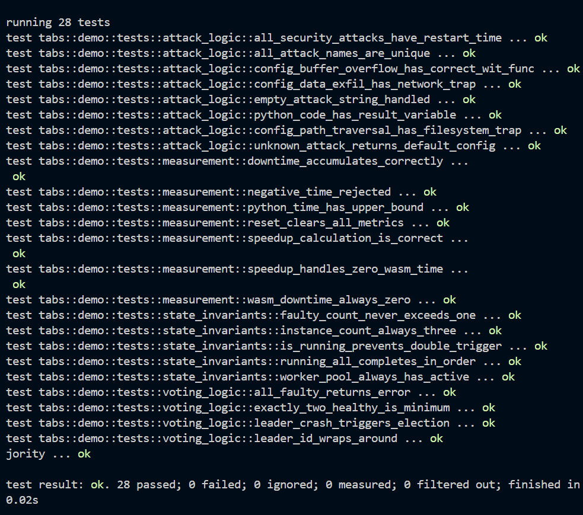

# Guardian One Web-Demo

**Industrial Edge Security Demonstration — Python vs WASM Side-by-Side**

[]()
[](https://www.rust-lang.org/)
[](https://wasi.dev/)
[](https://leptos.dev/)
[](LICENSE)

> A story-driven dashboard demonstrating WASI 0.2 capabilities vs traditional Python/Docker approaches through **real code execution** in the browser.

---

## The Thesis

| Challenge | Industry Today | WASI 0.2 Approach |
|:----------|:---------------|:------------------|
| **Isolation** | Docker namespaces (shared kernel) | WASM sandbox (boundary separation) |
| **Fault Recovery** | Process restart (~1.5s cold-start) | Instance re-instantiation (~0.03ms) |
| **Binary Size** | 50-500 MB container images | 15-70 KB component binaries |
| **Security Model** | Allow-then-block (iptables) | Deny-by-default (capability-based) |

---

## Live Demo Features

- **Real Pyodide Execution** — Python attacks run via actual Pyodide runtime
- **Real WASM Measurements** — Instantiation times measured with WebAssembly API
- **2oo3 TMR Voting** — Demonstrates Byzantine fault tolerance
- **Raft-like Leader Election** — Sub-ms failover vs ~1.5s Python respawn
- **WIT Contract Modal** — View the actual capability boundary definition

---

## Architecture

<details>
<summary><strong>📐 IEC 62443 Zone Diagram</strong></summary>



</details>

<details>
<summary><strong>🔧 Hardware Layer Diagram</strong></summary>



</details>

---

## Dashboard Tabs

| Tab | Purpose | Status |
|-----|---------|--------|
| **The Problem** | Why traditional ICS security fails — attack surface comparison | ✅ Complete |
| **The Hardware** | Architecture we're simulating — Purdue Model zones | 🔄 In Progress |
| **The Demo** | Live Python (Pyodide) vs WASM with attack scenarios | ✅ Complete |
| **The Proof** | Metrics simulation, foundation projects links | ✅ Complete |

---

## Quick Start

```bash
# Install trunk
cargo install trunk

# Run locally
cd dashboard && trunk serve --open
# Opens http://localhost:8080
```

---

## Project Structure

```
guardian-one-web-demo/
├── dashboard/               # Leptos frontend
│   └── src/
│       └── tabs/            # Story-driven tab components
│           ├── problem/     # Tab 1: Problem explanation
│           ├── hardware/    # Tab 2: Architecture diagram
│           ├── demo/        # Tab 3: Interactive attack demo
│           │   ├── types.rs
│           │   ├── attacks.rs
│           │   ├── wasm.rs
│           │   └── component.rs
│           └── proof/       # Tab 4: Metrics & foundation projects
├── wasm-modules/            # Rust WASM components
│   ├── sensor-driver/       # BME280 telemetry logic
│   └── modbus-parser/       # Industrial protocol parser
├── python-equivalents/      # Python code for Pyodide comparison
│   ├── sensor_driver.py
│   ├── modbus_parser.py
│   └── attacks/             # Attack scenario scripts
├── wit/                     # WASI interface definitions
│   └── attacks.wit          # Capability boundary contract
├── diagrams/                # Architecture diagrams
└── vercel.json              # Deployment configuration
```

---

## Metrics Accuracy

| Source | Measurement Method |
|--------|-------------------|
| **WASM Cold-Start** | Live measurement with `WebAssembly.instantiate()` (10 iterations avg) |
| **Python Cold-Start** | Real Pyodide reload measured fresh each simulation |
| **Attack Exceptions** | Real Python execution via Pyodide — actual exceptions |
| **Binary sizes** | Static values (actual `.wasm` file sizes) |

> All timing values are measured live in your browser. Python restart times use real Pyodide cold-start ± 200ms jitter for realistic variance.

---

## Testing

28 tests validate the demo's core guarantees:

| Module | Tests | Focus |
|--------|-------|-------|
| Attack Logic | 8 | WIT config accuracy, edge cases |
| Voting Logic | 8 | 2oo3 TMR, leader election |
| Measurement | 7 | Speedup math, bounds |
| State Invariants | 5 | System-wide guarantees |

```bash
cd dashboard && cargo test --lib
```



See [docs/TESTING.md](docs/TESTING.md) for full test documentation.

---

## Git Workflow

```
main ──────────────────────────────► Production (Vercel)
  │                                      ▲
  ▼                                      │
develop ───────────────────────────► Preview
  │         ▲         ▲
  ▼         │         │
feature/*   feature/* feature/*
```

---

## Related Projects (The Guardian One Foundation)

| Project | Focus | Demo |
|---------|-------|------|
| [ICS Guardian](https://github.com/gammahazard/vanguard-ics-guardian) | **Containment** — Capability sandboxing | [Live](https://vanguard-ics-guardian.vercel.app) |
| [Protocol Gateway](https://github.com/gammahazard/protocol-gateway-sandbox) | **Availability** — 2oo3 crash recovery | [Live](https://protocol-gateway-sandbox.vercel.app) |
| [Raft Consensus](https://github.com/gammahazard/Raft-Consensus) | **Consistency** — Distributed consensus | [Live](https://raft-consensus.vercel.app) |

---

## License

MIT © 2026

